# AggLayer Bridge Pre-Audit Report

**Scope:** On-chain MASM code for the AggLayer bridge integration on Miden.  
**Focus:** Asset minting/theft vulnerabilities, griefing attack vectors.  
**Date:** 2026-03-24

---

## 1. Architecture Overview

```mermaid
flowchart TD
    subgraph Bridge-In - Claim Flow
        A[CLAIM Note] -->|consumed by| B[Bridge Account]
        B -->|validates proof + creates| C[MINT Note]
        C -->|consumed by| D[AggFaucet]
        D -->|mints + creates| E[P2ID Note]
        E -->|consumed by| F[Destination Account]
    end

    subgraph Bridge-Out Flow
        G[B2AGG Note] -->|consumed by| H[Bridge Account]
        H -->|appends leaf to LET + creates| I[BURN Note]
        I -->|consumed by| J[AggFaucet]
    end

    subgraph Admin Flows
        K[CONFIG_AGG_BRIDGE Note] -->|consumed by| L[Bridge Account]
        L -->|registers faucet| L
        M[UPDATE_GER Note] -->|consumed by| N[Bridge Account]
        N -->|stores GER| N
    end
```

---

## 2. Findings Summary

| # | Severity | Title | Status |
|---|----------|-------|--------|
| F-01 | **INFO** | CLAIM note sender is unrestricted — anyone can submit claims | By Design |
| F-02 | **LOW** | Memory overlap between leaf data and proof data in claim flow | Safe by Design |
| F-03 | **MEDIUM** | Nullifier collision domain is narrow — only `leaf_index` and `source_bridge_network` | Investigate |
| F-04 | **INFO** | No metadata hash verification in bridge-in claim flow | By Design |
| F-05 | **INFO** | Bridge admin and GER manager are immutable after deployment | By Design |
| F-06 | **LOW** | Token registry allows overwriting existing faucet registrations | Investigate |
| F-07 | **INFO** | `miden_claim_amount` is user-supplied but verified on-chain | Safe |
| F-08 | **LOW** | No `destination_network` validation in bridge-in claim | Investigate |
| F-09 | **INFO** | B2AGG reclaim branch does not validate attachment target | Safe by Design |
| F-10 | **INFO** | MINT note serial number derived from PROOF_DATA_KEY is deterministic | By Design |

---

## 3. Detailed Findings

### F-01: CLAIM note sender is unrestricted [INFO]

**Location:** [`CLAIM.masm`](crates/miden-agglayer/asm/note_scripts/CLAIM.masm:139), [`bridge_in::claim`](crates/miden-agglayer/asm/agglayer/bridge/bridge_in.masm:194)

**Description:** Anyone can create and submit a CLAIM note. The CLAIM note script only checks that the consuming account matches the `NetworkAccountTarget` attachment (i.e., the bridge account). There is no sender restriction.

**Impact:** None — this is by design. The security of the claim flow relies entirely on the Merkle proof verification against a known GER, not on who submits the claim. The proof data is cryptographically verified, so a malicious sender cannot forge a valid claim.

**Assessment:** Safe. The claim is permissionless by design, similar to how anyone can call `claimAsset()` on the Solidity bridge.

---

### F-02: Memory overlap between leaf data and proof data in claim flow [LOW]

**Location:** [`bridge_in.masm`](crates/miden-agglayer/asm/agglayer/bridge/bridge_in.masm:85-98)

**Description:** The `claim` procedure uses overlapping memory regions:
- `CLAIM_PROOF_DATA_START_PTR = 0` and `CLAIM_LEAF_DATA_START_PTR = 536` (used by `claim_batch_pipe_double_words`)
- `LEAF_DATA_START_PTR = 0` (used by `get_leaf_value`)
- `PROOF_DATA_PTR = 0` (used by `verify_leaf`)

The flow is:
1. `claim_batch_pipe_double_words` loads proof data to `[0..535]` and leaf data to `[536..567]`
2. `load_destination_address` reads from `[544..548]` ✓ (before overwrite)
3. `get_leaf_value` overwrites `[0..31]` with leaf data (from advice map)
4. `verify_leaf` overwrites `[0..535]` with proof data (from advice map)
5. `load_origin_token_address` reads from `[538..542]` ✓ (not overwritten)
6. `load_raw_claim_amount` reads from `[549..556]` ✓ (not overwritten)

**Impact:** The memory reuse is safe because:
- Data at addresses 536+ is never overwritten by steps 3-4
- Steps 3-4 reload data from the advice map with preimage verification (the keys were already verified in step 1)
- The destination address is extracted before the overwrite

**Assessment:** Safe but fragile. Any future changes to memory layout could introduce bugs. Consider adding comments documenting the memory lifecycle.

---

### F-03: Nullifier collision domain is narrow [MEDIUM]

**Location:** [`set_and_check_claimed`](crates/miden-agglayer/asm/agglayer/bridge/bridge_in.masm:660-677)

**Description:** The claim nullifier is computed as `Poseidon2::hash_elements(leaf_index, source_bridge_network)`. This means:
- For mainnet deposits: nullifier = `hash(leaf_index, 0)`
- For rollup deposits: nullifier = `hash(leaf_index, rollup_index + 1)`

The `leaf_index` is a u32 value (0 to 2^32-1) and `source_bridge_network` is also a u32.

**Potential Issue:** If the same `leaf_index` appears in two different GERs (e.g., after a reorg or GER update), the nullifier would be the same, preventing the second claim. However, this matches the Solidity behavior exactly — `_setAndCheckClaimed(leafIndex, sourceBridgeNetwork)` uses the same two parameters.

**More importantly:** Two different deposits on the same source network with the same leaf index but different GERs would collide. This is correct behavior — the leaf index is unique per source network's Local Exit Tree, so two valid deposits cannot share the same `(leaf_index, source_bridge_network)` pair.

**Assessment:** Matches Solidity semantics. The nullifier domain is correct because leaf indices are monotonically increasing per source network. No vulnerability.

---

### F-04: No metadata hash verification in bridge-in claim flow [INFO]

**Location:** [`bridge_in::claim`](crates/miden-agglayer/asm/agglayer/bridge/bridge_in.masm:194)

**Description:** During bridge-in, the `metadata_hash` field in the leaf data is included in the Keccak leaf value hash (and thus verified by the Merkle proof), but it is never compared against the faucet's stored `metadata_hash`. The bridge trusts that the leaf data's metadata hash is correct because it's part of the Merkle proof.

**Impact:** None — the metadata hash is implicitly verified through the Merkle proof. If the metadata hash in the leaf data doesn't match what was deposited on L1, the Merkle proof would fail.

**Assessment:** Safe by design.

---

### F-05: Bridge admin and GER manager are immutable [INFO]

**Location:** [`bridge.rs`](crates/miden-agglayer/src/bridge.rs:427-443)

**Description:** The `bridge_admin_id` and `ger_manager_id` are set at account creation time as value slots. There is no procedure to update them. If either key is compromised, there is no way to rotate it without redeploying the bridge.

**Impact:** Operational risk. A compromised bridge admin could register malicious faucets. A compromised GER manager could inject fake GERs.

**Assessment:** This is a known design choice. Consider adding key rotation procedures in a future version.

---

### F-06: Token registry allows overwriting existing faucet registrations [LOW]

**Location:** [`bridge_config::register_faucet`](crates/miden-agglayer/asm/agglayer/bridge/bridge_config.masm:117-167)

**Description:** The `register_faucet` procedure does not check whether a faucet or token address is already registered. Calling it again with the same `origin_token_address` but a different `faucet_id` would overwrite the token registry entry. Similarly, re-registering the same faucet with a different token address would leave the old token→faucet mapping intact while creating a new one.

**Attack scenario:** A compromised bridge admin could:
1. Register a legitimate faucet for token X
2. Later re-register token X to point to a malicious faucet
3. Future claims for token X would mint from the malicious faucet

**Impact:** Medium operational risk, but requires bridge admin compromise. The bridge admin is already a trusted role.

**Mitigation:** Consider adding a check that prevents overwriting existing registrations, or add an explicit `unregister` + `register` flow.

---

### F-07: `miden_claim_amount` is user-supplied but verified on-chain [INFO]

**Location:** [`bridge_in::verify_claim_amount`](crates/miden-agglayer/asm/agglayer/bridge/bridge_in.masm:440-476), [`asset_conversion::verify_u256_to_native_amount_conversion`](crates/miden-agglayer/asm/agglayer/common/asset_conversion.masm:377-393)

**Description:** The `miden_claim_amount` (felt 568 in the CLAIM note storage) is provided by the note creator, not computed on-chain. However, the bridge verifies it on-chain via `verify_claim_amount`:

1. FPI call to faucet's `get_scale` to retrieve the scale factor
2. Load the raw U256 amount from the leaf data (which is Merkle-proof-verified)
3. Call `verify_u256_to_native_amount_conversion` which proves: `miden_claim_amount == floor(raw_amount / 10^scale)`

The verification is done by checking:
- `y * 10^scale <= x` (no underflow)
- `x - y * 10^scale < 10^scale` (remainder bound)
- `y <= FUNGIBLE_ASSET_MAX_AMOUNT`

**Assessment:** This is a sound verification approach. The user supplies `y` as a "hint" and the on-chain code proves it's correct. No way to inflate the minted amount.

---

### F-08: No `destination_network` validation in bridge-in claim [LOW]

**Location:** [`bridge_in::claim`](crates/miden-agglayer/asm/agglayer/bridge/bridge_in.masm:194)

**Description:** The `destination_network` field in the leaf data is never validated during the claim flow. The bridge does not check that the `destination_network` matches Miden's network ID. This means a deposit intended for a different AggLayer-connected chain could theoretically be claimed on Miden if the same GER is shared.

**However:** The `destination_address` is converted to a Miden `AccountId` via `eth_address::to_account_id`, which requires the first 4 bytes to be zero (a Miden-specific encoding). Deposits intended for other chains would have non-zero first bytes in the destination address, causing `to_account_id` to fail with `ERR_MSB_NONZERO`.

**Impact:** Low. The `to_account_id` check provides an implicit guard, but it's not a semantic check on the destination network. If another chain also uses the same address encoding (first 4 bytes zero), cross-chain claim theft could theoretically occur.

**Mitigation:** Consider adding an explicit `destination_network` check against a stored Miden network ID.

---

### F-09: B2AGG reclaim branch does not validate attachment target [INFO]

**Location:** [`B2AGG.masm`](crates/miden-agglayer/asm/note_scripts/B2AGG.masm:55-109)

**Description:** In the B2AGG note script, the reclaim branch (when `sender == consuming_account`) does not check the `NetworkAccountTarget` attachment. It simply adds assets back to the account.

**Assessment:** Safe. The reclaim branch is entered only when the consuming account IS the original sender. Since the sender created the note, they already own the assets. No attachment check is needed.

---

### F-10: MINT note serial number derived from PROOF_DATA_KEY is deterministic [INFO]

**Location:** [`bridge_in::write_mint_note_storage`](crates/miden-agglayer/asm/agglayer/bridge/bridge_in.masm:820-878), [`bridge_in::build_mint_recipient`](crates/miden-agglayer/asm/agglayer/bridge/bridge_in.masm:889-907)

**Description:** The MINT note's serial number is set to `PROOF_DATA_KEY` (the Poseidon2 hash of the proof data). This is deterministic — the same proof data always produces the same serial number. The P2ID note created by the faucet also uses `PROOF_DATA_KEY` as its serial number (via the MINT note storage at slots 12-15).

**Impact:** This is intentional. The deterministic serial number means the P2ID note ID is predictable, which is useful for the integration service to track notes. Since the claim nullifier prevents double-claiming, the same MINT note cannot be created twice.

---

## 4. Asset Minting/Theft Analysis

### Can an attacker mint assets without a valid deposit?

**No.** The claim flow requires:
1. A valid GER (stored by the trusted GER manager)
2. A valid Merkle proof against that GER
3. A registered faucet for the origin token address
4. The `miden_claim_amount` must match `floor(raw_amount / 10^scale)`

All of these are verified on-chain. The Merkle proof is a 32-level Keccak256 SMT proof, which is computationally infeasible to forge.

### Can an attacker claim more than the deposited amount?

**No.** The `verify_claim_amount` procedure proves that `miden_claim_amount == floor(raw_amount / 10^scale)` where `raw_amount` is extracted from the Merkle-proof-verified leaf data. The verification is mathematically sound (see F-07).

### Can an attacker double-claim?

**No.** The `set_and_check_claimed` procedure stores a nullifier `Poseidon2::hash_elements(leaf_index, source_bridge_network)` in a map slot. On the second claim attempt, the old value `[1, 0, 0, 0]` is returned and the assertion fails. This is tested in `test_duplicate_claim_note_rejected`.

### Can an attacker steal assets during bridge-out?

**No.** The bridge-out flow:
1. Validates the faucet is registered
2. Creates a BURN note with the asset, targeted to the faucet via `NetworkAccountTarget`
3. Only the target faucet can consume the BURN note

The B2AGG note also has a `NetworkAccountTarget` attachment ensuring only the bridge can consume it (non-reclaim path). This is tested in `b2agg_note_non_target_account_cannot_consume`.

### Can an attacker redirect minted assets to themselves?

**No.** The destination account ID is derived from the `destination_address` in the leaf data, which is part of the Merkle proof. An attacker cannot change the destination without invalidating the proof.

---

## 5. Griefing Attack Analysis

### Can an attacker prevent legitimate claims?

**Partially.** Since CLAIM notes are permissionless (anyone can create them), an attacker could:
1. Create a CLAIM note with the same proof data as a legitimate claim
2. Submit it before the legitimate claimer

However, this is NOT a griefing attack — it's actually beneficial. The claim would succeed and the assets would be delivered to the correct destination (as specified in the Merkle-proof-verified leaf data). The attacker would be paying transaction fees to help the legitimate recipient.

### Can an attacker spam the bridge with invalid claims?

**No meaningful impact.** Invalid claims would fail during Merkle proof verification, GER validation, or amount verification. The transaction would be rejected and the bridge state would not change.

### Can an attacker fill up the Local Exit Tree?

**Theoretically yes, but impractical.** The LET supports up to 2^32 - 1 leaves. Each leaf requires a valid B2AGG note with a registered faucet asset. The attacker would need to:
1. Own assets from a registered faucet
2. Create B2AGG notes and have them consumed by the bridge
3. The assets would be burned (lost to the attacker)

This is economically irrational — the attacker loses real assets.

### Can an attacker register a malicious faucet?

**Only with bridge admin compromise.** The `register_faucet` procedure checks that the note sender is the bridge admin. Without the admin's private key, an attacker cannot create a valid CONFIG_AGG_BRIDGE note.

### Can an attacker inject a fake GER?

**Only with GER manager compromise.** The `update_ger` procedure checks that the note sender is the GER manager.

---

## 6. Test Coverage Assessment

| Scenario | Tested? | Test |
|----------|---------|------|
| Happy path bridge-in (real data) | ✅ | `test_bridge_in_claim_to_p2id::real` |
| Happy path bridge-in (simulated) | ✅ | `test_bridge_in_claim_to_p2id::simulated` |
| Happy path bridge-in (rollup) | ✅ | `test_bridge_in_claim_to_p2id::rollup` |
| Double-claim rejection | ✅ | `test_duplicate_claim_note_rejected` |
| Merkle proof compatibility | ✅ | `solidity_verify_merkle_proof_compatibility` |
| Bridge-out consecutive (32 leaves) | ✅ | `bridge_out_consecutive` |
| Unregistered faucet rejection | ✅ | `test_bridge_out_fails_with_unregistered_faucet` |
| B2AGG reclaim | ✅ | `b2agg_note_reclaim_scenario` |
| Non-target account rejection | ✅ | `b2agg_note_non_target_account_cannot_consume` |
| Invalid Merkle proof rejection | ❌ | Not tested |
| Invalid GER rejection | ❌ | Not tested |
| Invalid amount (inflated) rejection | ❌ | Not tested |
| Wrong destination_network claim | ❌ | Not tested |
| Token registry overwrite | ❌ | Not tested |
| Mainnet flag > 1 rejection | ❌ | Not tested |
| Scale factor edge cases (0, 18) | ❌ | Not tested (in integration) |

---

## 7. Recommendations

### High Priority
1. **Add explicit `destination_network` check** (F-08): Store Miden's network ID in the bridge account and verify it during claim. While `to_account_id` provides an implicit guard, an explicit check is more robust.

### Medium Priority
2. **Prevent token registry overwrites** (F-06): Add a check in `register_faucet` that the token address is not already registered, or require an explicit unregister step.
3. **Add negative test cases**: Test invalid Merkle proofs, invalid GERs, inflated amounts, and wrong destination networks to ensure all error paths are exercised.

### Low Priority
4. **Document memory lifecycle** (F-02): Add comments in `bridge_in.masm` explaining the memory reuse pattern between `claim_batch_pipe_double_words`, `get_leaf_value`, and `verify_leaf`.
5. **Consider admin key rotation** (F-05): Add procedures to update the bridge admin and GER manager account IDs.

---

## 8. Conclusion

The AggLayer bridge implementation is **well-designed and secure** against the primary threat vectors (asset minting, theft, and double-claiming). The core security properties are:

- **Merkle proof verification** prevents forged claims
- **Amount verification** prevents inflated minting
- **Claim nullifiers** prevent double-claiming
- **NetworkAccountTarget attachments** prevent unauthorized note consumption
- **Sender checks** protect admin operations (CONFIG, UPDATE_GER)
- **Faucet registry** prevents unauthorized token bridging

The main areas for improvement are:
- Adding an explicit `destination_network` check (defense in depth)
- Preventing token registry overwrites
- Expanding negative test coverage
